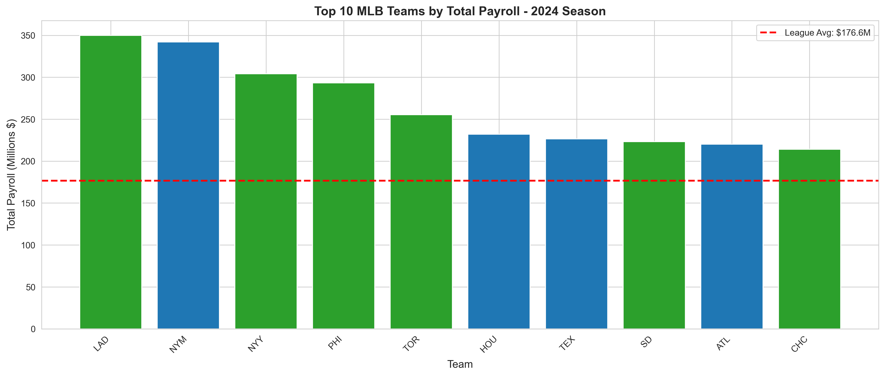
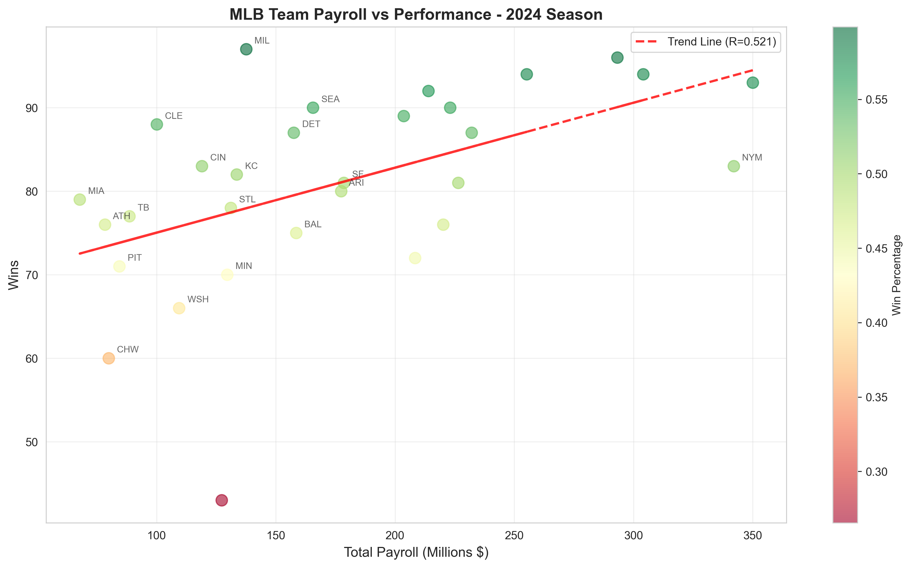
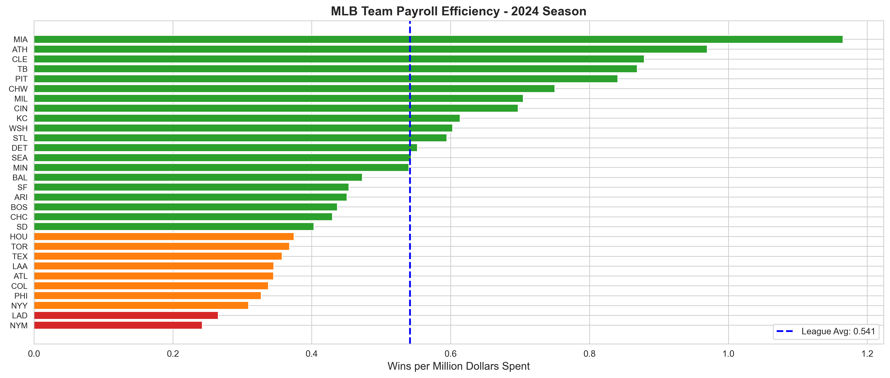
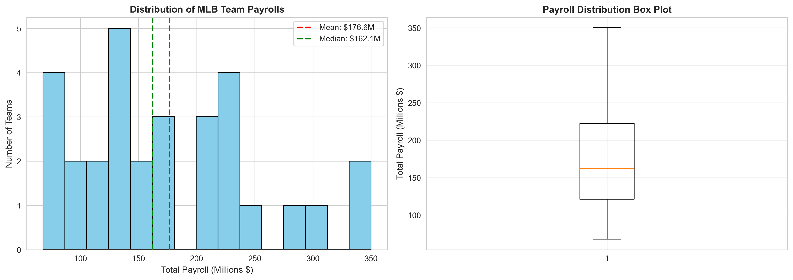

# MLB Team Payroll vs Performance Analysis (2025)

## Overview
Analysis exploring the relationship between MLB team spending and on-field success for the 2025 season across all 30 teams

## Key Findings
- **Payroll Range**: Teams spent between $79M (CHW) and $350M (LAD)
- **Correlation**: Moderate positive correlation (r=0.521) between payroll and wins
- **Top Spender**: Los Angeles Dodgers ($350M, 93 wins)
- **Most Efficient Teams**: Miami Marlins, Atlanta Braves, and Cleveland Guardians achieving 0.90+ wins per million spent
- **Least Efficient**: New York Mets ($342M, 83 wins - only 0.24 wins per $M)
- **Key Insight**: While higher payroll correlates with more wins, efficiency varies dramatically - several low-budget teams outperformed $200M+ competitors

## Visualizations

### Top 10 Team Payrolls

*Red dashed line shows league average payroll at $167.5M*

### Payroll vs Performance Relationship

*Scatter plot with trend line showing R=0.521 correlation. Color indicates win percentage - darker green = better performance*

### Team Efficiency Rankings

*Wins per million dollars spent - Green bars above league average (0.541), orange/red below average*

### Payroll Distribution Across MLB

*Statistical distribution showing spending patterns league-wide*

## Tools & Technologies
- **Python 3.12**: pandas, matplotlib, seaborn, numpy
- **Analysis Techniques**: 
  - Correlation analysis (Pearson correlation coefficient)
  - Efficiency metrics (wins per dollar spent)
  - Statistical distribution analysis
  - Outlier identification
- **Data Visualization**: Bar charts, scatter plots, horizontal bar charts, histograms & box plots

## Business Insights
- **Moderate correlation (0.521)** suggests money helps but isn't everything - roster construction and player development matter
- **Diminishing returns**: Teams spending $250M+ don't guarantee proportional success
- **Efficiency winners**: Small-market teams (MIA, CLE, ATH) achieved nearly 1.0 wins per $M - double the league average
- **Efficiency losers**: High-spending teams (NYM, NYY, LAD) achieved only 0.24-0.27 wins per $M
- **Sweet spot**: Mid-market teams ($150-200M) can compete effectively with strategic spending
- **Chicago White Sox** outlier: Despite low payroll ($79M), won only 60 games (0.76 wins/$M)

## Project Structure
```
mlb-payroll-analysis/
├── mlb_analysis.py              # Main analysis script
├── mlb_payroll.csv              # Source data (2025 season)
├── mlb_payroll_summary.csv      # Processed results
├── top_10_payrolls.png          # Visualization 1
├── payroll_vs_wins.png          # Visualization 2
├── payroll_efficiency.png       # Visualization 3
└── payroll_distribution.png     # Visualization 4
```

## How to Run
```bash
# Clone the repository
git clone https://github.com/YOUR-USERNAME/mlb-payroll-analysis.git

# Navigate to directory
cd mlb-payroll-analysis

# Install dependencies
pip install pandas matplotlib seaborn numpy

# Run the analysis
python mlb_analysis.py
```

## Sample Output
```
Correlation between Total Payroll and Wins: 0.521
Average Total Payroll: $167.50M
Median Total Payroll: $165.56M
Most Efficient Team: Miami Marlins with 1.02 wins per $M
Least Efficient Team: New York Mets with 0.24 wins per $M
```
*Data Source: MLB 2025 Season Team Payrolls | Analysis completed November 2025*
