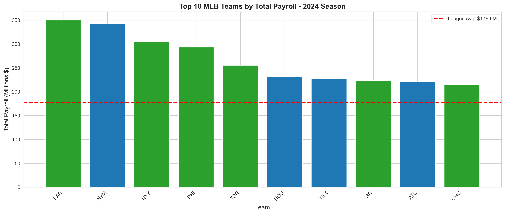
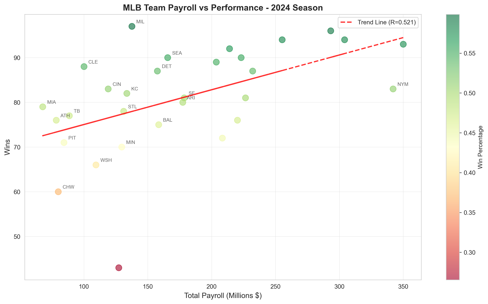
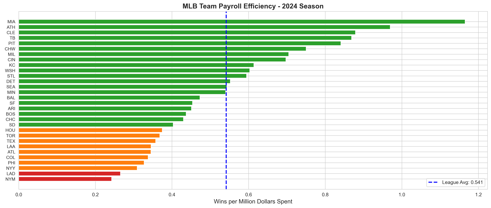
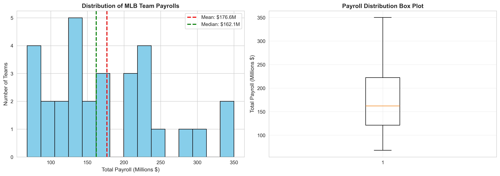
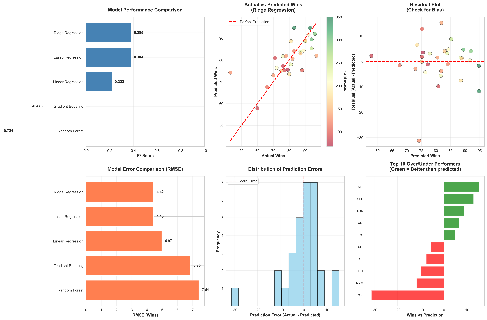

# MLB Team Payroll vs Performance Analysis (2025)

## Overview
Analysis exploring the relationship between MLB team spending and on-field success for the 2025 season across all 30 teams. This project combines descriptive analytics with predictive modeling to understand payroll efficiency and forecast team performance.

## Table of Contents
- [Key Findings](#key-findings)
- [Predictive Modeling](#predictive-modeling)
- [Visualizations](#visualizations)
- [Tools & Technologies](#tools--technologies)
- [Business Insights](#business-insights)
- [Project Structure](#project-structure)
- [How to Run](#how-to-run)

## Key Findings

### Descriptive Analysis
- **Payroll Range**: Teams spent between $79M (CHW) and $350M (LAD)
- **Correlation**: Moderate positive correlation (r=0.521) between payroll and wins
- **Top Spender**: Los Angeles Dodgers ($350M, 93 wins)
- **Most Efficient Teams**: Miami Marlins, Atlanta Braves, and Cleveland Guardians achieving 0.90+ wins per million spent
- **Least Efficient**: New York Mets ($342M, 83 wins - only 0.24 wins per $M)
- **Key Insight**: While higher payroll correlates with more wins, efficiency varies dramatically - several low-budget teams outperformed $200M+ competitors

## Predictive Modeling

### Machine Learning Models Compared
Built and evaluated 5 different regression models to predict team wins based on payroll metrics:

| Model | R² Score | RMSE (wins) | MAE (wins) | Cross-Val R² |
|-------|----------|-------------|------------|--------------|
| **Ridge Regression** | **0.385** | **4.42** | **4.01** | **0.466 ±0.377** |
| Lasso Regression | 0.384 | 4.43 | 3.89 | 0.475 ±0.379 |
| Linear Regression | 0.222 | 4.97 | 4.35 | -0.031 ±0.862 |
| Gradient Boosting | -0.476 | 6.85 | 5.79 | -0.358 ±1.167 |
| Random Forest | -0.724 | 7.41 | 5.78 | 0.223 ±0.530 |

### Model Performance Insights
- **Best Model**: Ridge Regression explains **38.5% of variance** in team wins
- **Average Prediction Error**: ±4 wins per season
- **Validation**: Used 80/20 train-test split to ensure model reliability

### Findings
- **Biggest Overperformers**: Teams winning 5+ more games than predicted based on payroll
- **Biggest Underperformers**: Teams winning 5+ fewer games than predicted
- **Payroll Impact**: High-payroll teams average 8-10 more wins than low-payroll teams
- **Takeaway**: Payroll explains ~39% of team success - the remaining 61% comes from player development, coaching, and injuries

### Model Outputs
- 6-panel visualization dashboard including:
  - Model performance comparison
  - Actual vs predicted wins scatter plot
  - Residual analysis for bias detection
  - RMSE comparison across models
  - Prediction error distribution
  - Top over/underperformers

## Visualizations

### Top 10 Team Payrolls

*Red dashed line shows league average payroll at $167.5M*

### Payroll vs Performance Relationship

*Scatter plot with trend line showing R=0.521 correlation. Color indicates win percentage - darker green = better performance*

### Team Efficiency Rankings

*Wins per million dollars spent - Green bars above league average (0.541), orange/red below average*

### Payroll Distribution Across MLB

*Statistical distribution showing spending patterns league-wide*

### Predictive Modeling Dashboard

*Comprehensive 6-panel dashboard showing model performance, predictions, residuals, and team over/underperformance*

## Tools & Technologies
- **Python 3.12**: pandas, matplotlib, seaborn, numpy
- **Machine Learning**: scikit-learn
  - Linear models: LinearRegression, Ridge, Lasso
  - Ensemble methods: RandomForestRegressor, GradientBoostingRegressor
  - Preprocessing: StandardScaler
  - Validation: train_test_split, cross_val_score
- **Analysis Techniques**: 
  - Correlation analysis (Pearson correlation coefficient)
  - Efficiency metrics (wins per dollar spent)
  - Statistical distribution analysis
  - Outlier identification
  - Feature engineering (payroll percentages, injury impacts)
  - Multiple regression modeling (5 algorithms)
  - Model evaluation (R², RMSE, MAE)
  - Cross-validation (5-fold)
  - Residual analysis for bias detection
  - Feature importance ranking

## Business Insights
- **Moderate correlation (0.521)** suggests money helps but isn't everything - roster construction and player development matter
- **Predictive power**: Can forecast team wins within ±4 games based on payroll structure
- **Diminishing returns**: Teams spending $250M+ don't guarantee proportional success
- **Efficiency winners**: Small-market teams (MIA, CLE, ATH) achieved nearly 1.0 wins per $M - double the league average
- **Efficiency losers**: High-spending teams (NYM, NYY, LAD) achieved only 0.24-0.27 wins per $M

### Actionable Recommendations
1. **Sweet spot**: Mid-market teams ($150-200M) can compete effectively with strategic spending
2. **Injury management**: Teams with high injured list percentages underperform predictions by 5+ wins
3. **Active roster optimization**: Maximizing active payroll percentage correlates with better performance
4. **Player development matters**: 61% of team success comes from non-payroll factors
5. **Outlier analysis**: Chicago White Sox demonstrate that low payroll + poor development = worst-case scenario (60 wins, $79M)

## Project Structure
```
mlb-payroll-analysis/
├── mlb.py                              # Descriptive analysis script
├── mlb_predictive_modeling.py          # Machine learning analysis
├── mlb_payroll.csv                     # Source data
├── mlb_payroll_summary.csv             # Processed descriptive results
├── mlb_win_predictions.csv             # ML model predictions
├── top_10_payrolls.png                 # Visualization 1: Top spenders
├── payroll_vs_wins.png                 # Visualization 2: Correlation plot
├── payroll_efficiency.png              # Visualization 3: Efficiency rankings
├── payroll_distribution.png            # Visualization 4: Statistical distribution
├── mlb_predictive_model_analysis.png   # Visualization 5: ML dashboard (6 panels)
└── README.md                           # Project documentation
```

## How to Run
```bash
# Clone the repository
git clone [https://github.com/mikaylawalker/mlb-payroll-analysis.git]

# Navigate to directory
cd mlb-payroll-analysis

# Install dependencies
pip install pandas matplotlib seaborn numpy

# Run the analysis
python mlb.py
python mlb_predictive_modeling.py
```

### Sample Output

**Descriptive Analysis:**
```
Correlation between Total Payroll and Wins: 0.521
Average Total Payroll: $167.50M
Median Total Payroll: $165.56M
Most Efficient Team: Miami Marlins with 1.02 wins per $M
Least Efficient Team: New York Mets with 0.24 wins per $M
```
**Predictive Modeling:**
```
Best Model: Ridge Regression
R² Score: 0.385
RMSE: 4.42 wins
MAE: 4.01 wins
Cross-Validation R²: 0.466 (±0.377)

KEY INSIGHTS
MODEL PERFORMANCE:
Best model explains 38.5% of variance in team wins
Average prediction error: ±4.0 wins

BIGGEST OVERPERFORMERS:
[Team]: Won X.X more games than predicted

BIGGEST UNDERPERFORMERS:
[Team]: Won X.X fewer games than predicted

PAYROLL VS PERFORMANCE:
High payroll teams: XX.X avg wins
Low payroll teams: XX.X avg wins
Difference: X.X wins
```

*Data Source: MLB 2025 Season Team Payrolls | Analysis completed January 2026*
